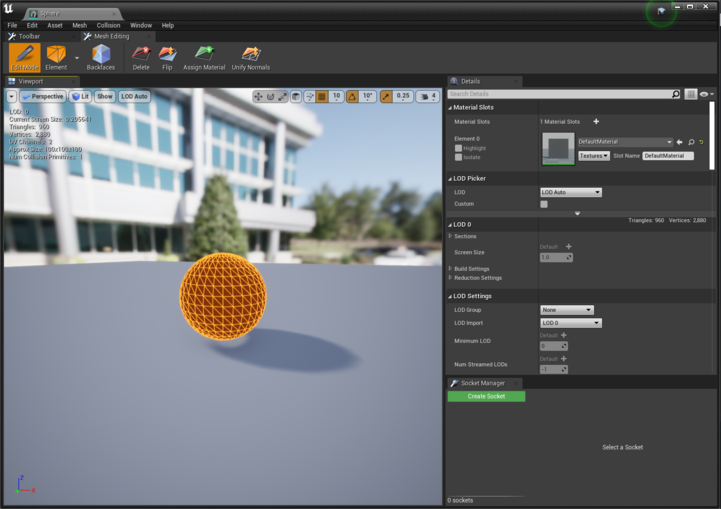
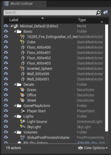

# Airsim 3D Object Detection
In this repository you will find an 3D object detection datasets generator for YOLOv5-6D model.  

## Dependencies

- Python packages: `pip3 install -r requirements.txt`
- Install Airsim  
    ```
    git clone https://bitbucket.org/fadacatec-ondemand/airsim
    cd airsim
    ./build.sh
    ./setup.sh   
    ```
- Install Python client
    ```
    cd airsim/PythonClient
    pip3 install msgpack-rpc-python
    pip3 install .
    ```
- Install Unreal Engine and airsim plugin. 

## Setup  
- Open an Unreal Project with AirSim GameMode and create a sphere actor. 
- Enable **Polygon Editing** plugin and, in the sphere editor, select the entire element and flip normals.

    

- Check that the sphere is a stationary or movable object and change its scale as needed. 

## Usage
Steps:

- Import 3D model of the object you want to detect and change it Mobility option to Movable. Make sure that the reference frame center of the object to be detected corresponds to its center.  
- Get the ID names of the sphere and detection object items and change it into `dataset_generator.py`.

    

- Set the directory name as you want. 
- Set the value of the initial distance (depth of the object to the camera) so that for the first detection the whole object is observed. 
- Run Unreal with AirSim plugin enabled.  
- Run `dataset_generator.py` on a terminal and wait until the desired number of files are generated.  
- If you want to add or change backgrounds, download some HDRIs with **.ext** extension and save them on backgrounds directory. You can also use image formats such as **.jpg** or **.png**, but these may be distorted.  

### Dataset format
```
Object
├── train.txt
├── training_range.txt
├── validation.txt
├── 3D_Object_model.ply
├── images
|   ├── 0.jpg
|   └── ...
└── labels
    ├── 0.txt
    └── ...
```

(You must include the 3D model manually)

### utils directory
In this directory you can find two scripts: 

- `create_data_splits.py`: shuffles a list of image files from a specified directory and splits them into training and validation sets, and writes these filenames to separate text files. 
- `test_generator`: Capture, display, and save images with detected object points, while allowing the user to trigger image capture via a key press. 